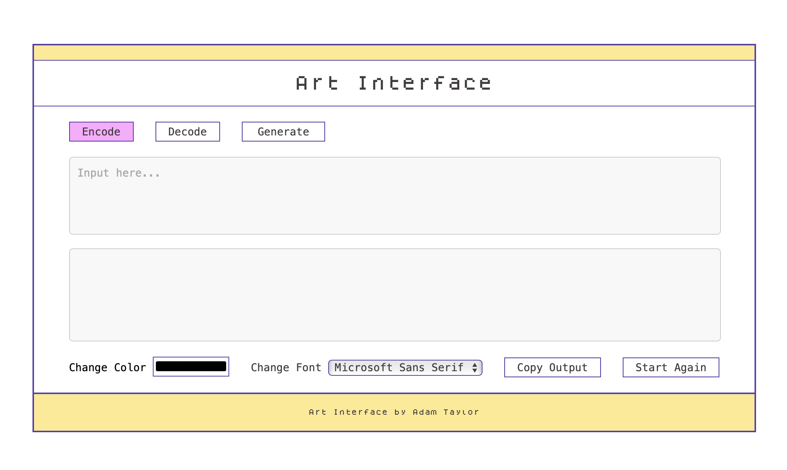

# Text Art Encoder and Decoder Projects

### Overview

This repository contains two projects for encoding and decoding text art: art-decoder is a command-line driven application, and art-interface is a web application. Both projects aim to provide users with a convenient tool for encoding and decoding text-based art.

### Preview of Art Interface
